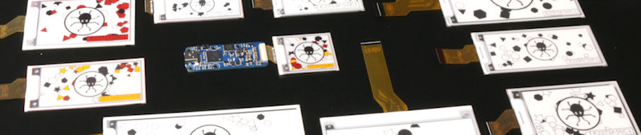
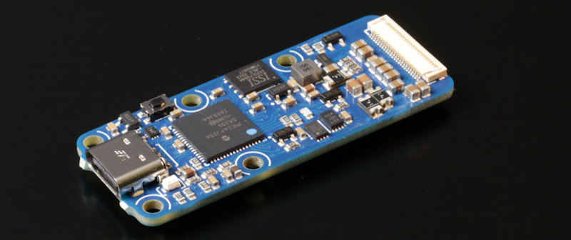

# Yoctopuce driver for Pervasive Displays screens

In accordance with the <i>Attribution-ShareAlike 4.0 International (CC BY-SA 4.0)
license</i> of Pervasive Displays display drivers, this project is intended to
share with the community the code used by Yoctopuce ePaper display driver
in its device named [Yocto-Display-ePaper-C](https://www.yoctopuce.com/EN/products/yocto-display-ePaper-C).

This project is NOT the full firmware of [Yocto-Display-ePaper-C](https://www.yoctopuce.com/EN/products/yocto-display-ePaper-C).
It is merely a test application to demonstrate the usage of our
rewritten driver for Pervasive Displays ePaper panels.

## This project is derivative work

Methods and commands used in this code have been derived from 
Pervasive Displays Inc. public drivers and public documentation. 
More specifically, Yoctopuce driver is based on the following 
libraries from Pervasive Displays Inc.:

* Pervasive Displays EPD hardware drivers (release 10.0)
     https://github.com/PervasiveDisplays/Pervasive_Wide_Small (Film K)
     https://github.com/PervasiveDisplays/Pervasive_BWRY_Small (Film Q)
     Copyright (c) Pervasive Displays, 2010-2025
     Portions (c) Rei Vilo, 2010-2025
     Based on highView technology
     For exclusive use with Pervasive Displays screens
     License: Attribution-ShareAlike 4.0 International (CC BY-SA 4.0)
 
* Pervasive Displays Library Suite - Basic edition - Fast Update (release 8.2)
     https://github.com/PervasiveDisplays/PDLS_EXT3_Basic_Fast (Film P)
     Copyright (c) Rei Vilo, 2010-2025
     Portions (c) Pervasive Displays, 2010-2025
     Based on highView technology
     For exclusive use with Pervasive Displays screens
     License: Attribution-ShareAlike 4.0 International (CC BY-SA 4.0)

* Pervasive Displays Library Suite - Basic edition - Global Update (release 8.2)
     https://github.com/PervasiveDisplays/PDLS_EXT3_Basic_Global (Film C,J)
     Copyright (c) Rei Vilo, 2010-2025
     Portions (c) Pervasive Displays, 2010-2025
     Based on highView technology
     For exclusive use with Pervasive Displays screens
     License: Attribution-ShareAlike 4.0 International (CC BY-SA 4.0)

## Changes compared to the original material

This driver is a complete rewrite of the code, with the following objectives
in mind:

### Single driver for various types of display panels

As the [Yocto-Display-ePaper-C](https://www.yoctopuce.com/EN/products/yocto-display-ePaper-C)
is intended to work with many different display panels, we have designed a driver
that can work with all "Small" displays, regardless of the type of Film used.
This driver works in particular for Film C, Film J, Film P, Film K, and Film Q.

### Only vanilla C code

As our device firmware does not use C++, we have rewritten the driver
as a single vanilla `.c` file.

### High performance on 16-bit PIC24F MCU

This code is optimized to run on a 16-bitt MCU, using the hardware I/O peripherals
with interrupt-based processing for fast SPI communication.

### No blocking function

The code has been entirely rewritten using state machines ensure that long refresh
operations never block the execution flow. The code uses pseudo-asynchronous functions
which are called repeatedly until their work is completed.

### Same entry point for Global updates and Fast updates

Instead of using different functions to trigger global or fast updates,
fast updates can be enabled or disabled on case by case using a simple flag, 
which makes it possible to configure the frequency of global updates
independently of the display flow.

### Support for 1bpp and 2bpp panels (BW, BWR and BWRY)

The same entry point work and Framebuffer format work for various panels.
Even if, at communication level, BWR panels use a completely different
data structure, this driver presents them as a 2bpp buffer, compatible
with the new data structure used by BWRY panels.

## Structure of this project

This project is a stand-alone MPLAB X 5.40 project, that you can build and flash using an ICD interface
on the PIC24FJ256DA206 MCU. 

| Fichier / Dossier | Description                                                                                                                                                         |
|---|---------------------------------------------------------------------------------------------------------------------------------------------------------------------|
| `nbproject` | This directory contains MPLAB X project files (based on NETBeans) |
| `ydisplay_PervasiveDisplays.c` | This file is the key component of this driver, and is included "as is" in the firmware of [Yocto-Display-ePaper-C](https://www.yoctopuce.com/EN/products/yocto-display-ePaper-C). |
| `main.c` | This file implements a simple ready-to-use stand-alone application to demonstrates the usage of the driver on a real device. |
| `api.h` | This file serves as linkage between `ydisplay_PervasiveDisplays.c` and `main.c` |

For a quick test, you can reflash a [Yocto-Display-ePaper-C](https://www.yoctopuce.com/EN/products/yocto-display-ePaper-C)
using an ICD to produce a working proof of concept.

   

## (C) Copyright and license

These enhancementsd are Copyright (c) Yoctopuce Sarl, 2026
License: Attribution-ShareAlike 4.0 International (CC BY-SA 4.0)

If you reuse any part of this work, you must give appropriate credit.
